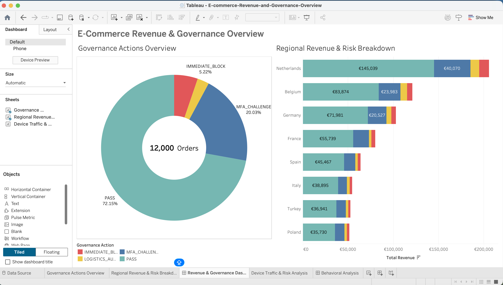
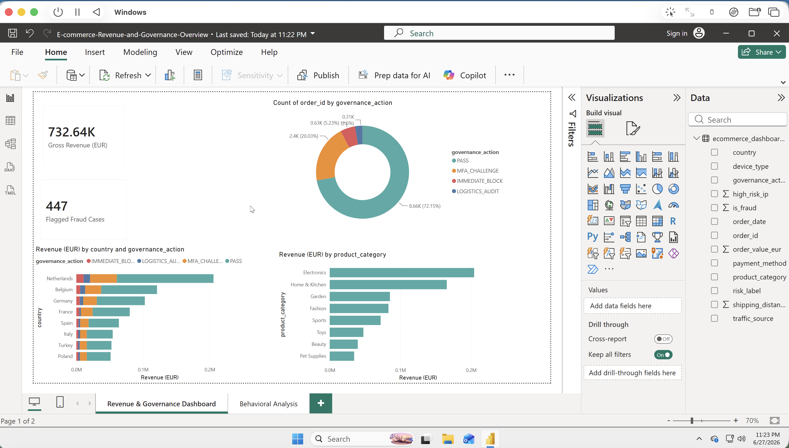
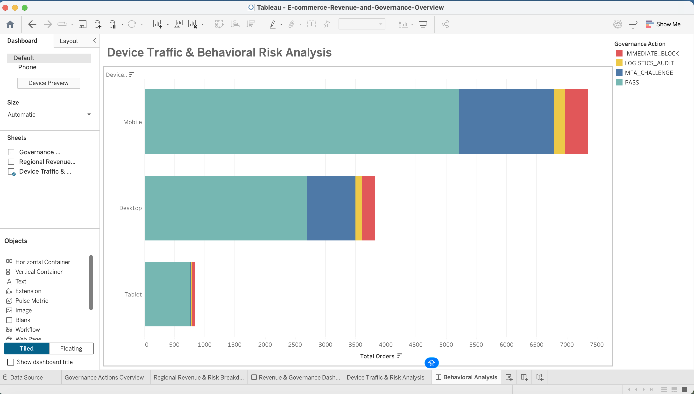
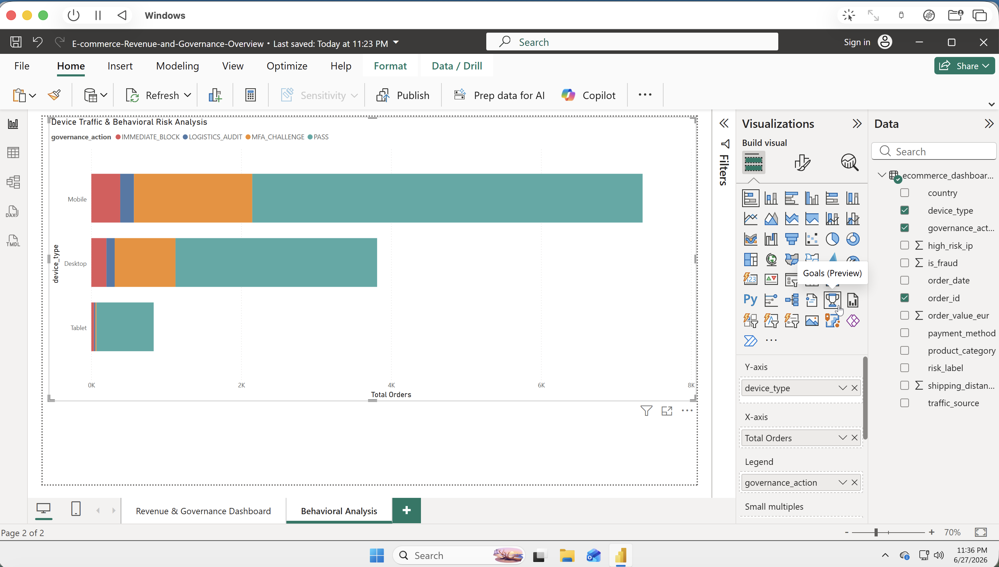

# Dual-Platform E-Commerce Revenue & Governance Analytics System

## 📌 Executive Summary
This enterprise-grade business intelligence solution provides senior management with a two-tier visibility framework into e-commerce operations, financial health, and automated risk governance. 

Organizations face a constant balancing act between maximizing transactional throughput and mitigating risk[cite: 1]. This project establishes a streamlined, interactive framework to monitor macro-level revenue health while enabling operational teams to perform surgical drill-downs into risk vectors across distinct technical channels[cite: 1]. Across 12,000 audited orders totaling €732,640 in gross revenue, the underlying Risk Scoring Rule Engine flags 447 confirmed fraud cases and a further 2,403 + 312 transactions for additional verification, while still clearing 72.15% of volume for immediate, frictionless processing.

## 🖼️ Visual System Interfaces

### Tier 1: Strategic Revenue & Governance Overview
#### Tableau Implementation:

#### Power BI Production Migration:

---

### Tier 2: Operational Device Traffic & Behavioral Risk Analysis
#### Tableau Implementation:

#### Power BI Production Migration:

## 🛠️ System Architecture & Visual Design Framework
The portfolio is intentionally structured into a **Two-Tier Analytical Funnel** across the industry's leading BI applications (**Tableau** and **Power BI**)[cite: 1]. This ensures platform agility and provides immediate "Time-to-Insight" for diverse corporate audiences[cite: 1].

### 1. The Strategic Layer (Dashboard Page 1: Revenue & Governance Overview)
* **Target Audience:** C-Suite and Executive Leadership[cite: 1].
* **Objective:** Monitor macro operational health and geographical revenue concentration[cite: 1].
* **Core Components:**
  * **Governance Actions Overview:** A clean donut chart layout acting as a baseline health check[cite: 1]. It isolates system performance metrics, showing a 72.15% transaction `PASS` rate, a 20.03% `MFA_CHALLENGE` rate, a 5.22% `IMMEDIATE_BLOCK` rate, and a 2.60% `LOGISTICS_AUDIT` rate — figures that are intentionally aligned with the multi-condition Risk Scoring Rule Engine validated in the companion SQL audit notebook, rather than a simplified standalone calculation[cite: 1].
  * **Regional Revenue & Risk Breakdown:** A sorted horizontal bar matrix tracking total revenue across international markets (led by the Netherlands at €205,837 of €732,640 total gross revenue)[cite: 1]. Each market bar is dynamically stacked with automated system responses, visually pinning risk concentrations to specific revenue streams[cite: 1].

### 2. The Operational Layer (Dashboard Page 2: Device Traffic & Behavioral Risk Analysis)
* **Target Audience:** Operations, Product Teams, and Risk Analysts[cite: 1].
* **Objective:** Tactical drill-down to isolate platform-specific behavior and identify underlying risk vectors ("The *Why* Layer")[cite: 1].
* **Core Components:**
  * **Device Traffic & Risk Analysis:** A descending horizontal stacked bar chart structuring transaction volumes across active hardware formats[cite: 1]. It immediately highlights that while **Mobile** drives the bulk of corporate transaction traffic (over 7,100 passing orders), it simultaneously scales as our primary risk vector, capturing the highest concentration of `MFA_CHALLENGE` interventions and `IMMEDIATE_BLOCK` actions[cite: 1].

### 🎨 Cross-Platform Design & Palette Alignment
To maintain strict enterprise branding during the cross-platform migration from Tableau to Power BI, the visual themes were mapped to a matching design palette:
* 🟢 **PASS (`#4EAAA6`):** Teal/Seafoam green signifying low-risk, successful transactions.
* 🔵 **MFA_CHALLENGE (`#4E79A7`):** Slate blue for multi-factor authentication checkpoints.
* 🟠 **LOGISTICS_AUDIT (`#F28E2B`):** Distant orange-yellow for shipping/distance anomalies.
* 🔴 **IMMEDIATE_BLOCK (`#E15759`):** Soft red for immediate fraud isolation.

---

## 📂 Repository Structure
* **`/Tableau`**: Contains the fully packaged workbook (`.twbx`) utilizing advanced dashboard containers, customized sheet swapping, and standardized formatting rules[cite: 1].
* **`/E-commerce-Revenue-and-Governance-Overview.*` (Power BI Developer Project)**: Saved using the modern Power BI Project (`.pbip`) directory structure to expose underlying metadata schemas for enterprise version control and CI/CD pipelines:
  * 📂 `*.SemanticModel/`: Houses data relationship modeling, column schemas, and core metadata definitions.
  * 📂 `*.Report/`: Contains visual canvas layouts, theme color structures, and individual page properties.
  * 📄 `definition.pbism`: The core project manifest binding the report elements to the underlying dataset.
* **`/documentation_images`**: High-resolution visual captures of the active analytics assets for immediate review[cite: 1].

---

## 📈 Technical Skillsets Demonstrated
* **Dual-Platform Competency:** Re-engineering workflows across both Tableau and Power BI environments to match enterprise reporting specs.
* **Bidirectional Interaction Modeling:** Implementing advanced Power BI "Edit Interactions" to structurally bind components for precise cross-filtering.
* **Data Storytelling & Governance:** Translating multi-dimensional data models into clean, corporate designs optimized for rapid executive decision-making[cite: 1].

---

## 🚀 How to Run Locally
### For Tableau:
Open the `.twbx` file inside the `/Tableau` directory using Tableau Desktop or Tableau Public[cite: 1].

### For Power BI:
1. Ensure you have the latest version of **Power BI Desktop** installed.
2. Open the `definition.pbism` file inside the main folder to launch the complete developer environment.